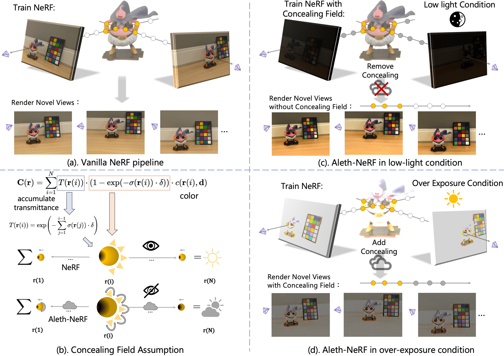
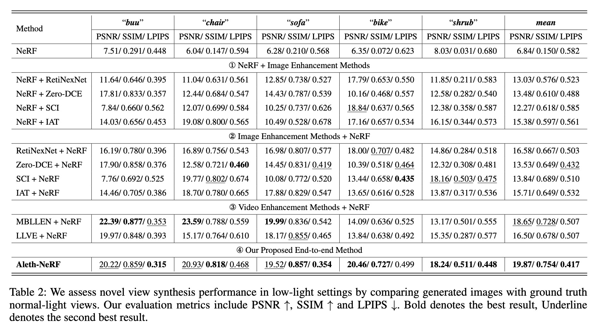

# [AAAI 2024] Aleth-NeRF: Illumination Adaptive NeRF with Concealing Field Assumption 

# [(ArXiv)](https://arxiv.org/abs/2312.09093) [(Website)](https://cuiziteng.github.io/Aleth_NeRF_web/) [(Dataset)](https://drive.google.com/file/d/1orgKEGApjwCm6G8xaupwHKxMbT2s9IAG/view?usp=sharing) [(ZhiHu中文解读)](https://zhuanlan.zhihu.com/p/621566180)

[Ziteng Cui<sup>1,2</sup>](https://cuiziteng.github.io/), 
[Lin Gu<sup>3,1</sup>](https://sites.google.com/view/linguedu/home), 
[Xiao Sun<sup>2*</sup>](https://jimmysuen.github.io/), 
[Xianzheng Ma<sup>4</sup>](https://xianzhengma.github.io/), 
[Yu Qiao<sup>2</sup>](http://mmlab.siat.ac.cn/yuqiao/), 
[Tatsuya Harada<sup>1,3</sup>](https://www.mi.t.u-tokyo.ac.jp/harada/). 

<sup>1.</sup>The University of Tokyo, <sup>2.</sup>Shanghai AI Lab, <sup>3.</sup>RIKEN AIP, <sup>4.</sup>University of Oxford

<br/>

**2024.1.25 :** Update the renewed experimental results and dataset, update the new [arxiv](https://arxiv.org/pdf/2312.09093.pdf) version. We now provide all the comparision results and you can feel free to make comparision on your own research. You can download the experimental results of Aleth-NeRF and comparison methods, 
				**Low-Light-Results** from [(google drive)](https://drive.google.com/file/d/1JzutV7Fi8rdabBDfl3-T53o_cfwdfdjY/view?usp=sharing) or [(baiduyun (passwd: 729w))](https://pan.baidu.com/s/1X-GntkVxYIf9hDaerEHRKg), 
				and **Over-Exposure Results** from [(google drive)](https://drive.google.com/file/d/11I903qBsLf9B7zqjcV0yjRXd1Ziy3d35/view?usp=sharing) or [(baiduyun (passwd: 6q4k))](https://pan.baidu.com/s/1nsYSzKehUgljqQpJ8qzHCA).

<br/>


<br/>

***" Can you see your days blighted by darkness ? "
\
                      -- Pink Floyd (Lost For Words)***

<br/>


## :house: Abstract


The standard Neural Radiance Fields (NeRF) paradigm employs a viewer-centered methodology, entangling the aspects of illumination and material reflectance into emission solely from 3D points. This simplified rendering approach presents challenges in accurately modeling images captured under adverse lighting conditions, such as low light or over-exposure. Motivated by the ancient Greek emission theory that posits visual perception as a result of rays emanating from the eyes, we slightly refine the conventional NeRF framework to train NeRF under challenging light conditions and generate normal-light condition novel views unsupervised. We introduce the concept of a ”Concealing Field,” which assigns transmittance values to the surrounding air to account for illumination effects. In dark scenarios, we assume that object emissions maintain a standard lighting level but are attenuated as they traverse the air during the rendering process. Concealing Field thus compel NeRF to learn reasonable density and colour estimations for objects even in dimly lit situations. Similarly, the Concealing Field can mitigate over-exposed emissions during the rendering stage. Furthermore, we present a comprehensive multi-view dataset captured under challenging illumination conditions for evaluation. 


<div align="center">
  
</div>
<p align="left">
   We assume objects are naturally visible. However, the Concealing Field attenuates the light in the viewing direction, making the people see a low-light scene. (c). Remove the concealing field, we can render out normal-light images in low-light scenes. (d). Add the concealing field, we can render out normal-light in over-exposure scenes. 
</p>


<br/>

## Enviroment setup:


```
1. 
$ git clone https://github.com/cuiziteng/Aleth-NeRF.git

$ cd Aleth-NeRF


2. (You can adjust to your own torch>1.8.0 version and CUDA version)
$ conda create -n aleth_nerf -c anaconda python=3.8
$ conda activate aleth_nerf
$ conda install pytorch==1.11.0 torchvision==0.12.0 torchaudio==0.11.0 cudatoolkit=11.3 -c pytorch
$ pip3 install -r requirements.txt
```


<br/>

## Usage:

### (1). Proposed dataset

We collect the first paired low-light & normal-light & over-exposure multi-view images dataset. Download the **LOM** (Low-light and Over-exposure Multi-view) dataset from: [google drive](https://drive.google.com/file/d/1Fhe4UZ4aIgiMHiVzizvvqWukLkefygmL/view?usp=sharing) or [baiduyun (passwd: cbhr)](https://pan.baidu.com/s/1Jx6wqbLvBVSHJRLNQYARlA). 

LOM dataset contains 5 scenes (*buu* | *chair* | *sofa* | *bike* | *shrub*), each scene includes 25~65 paired multi-view normal-light & low-light images & over-exposure images, and low-light images enhanced by different 2D low-light enhancement methods.

Unzip the download file, place LOM under $./data$ folder, then LOM dataset format as follow:

```
data     
└───
    LOM_full      
    └─── buu
        │─── colmap_sparse
        │─── colmap_text
        │─── high (normal-light images)
        │─── low  (low-light images)
        │─── over_exp  (over-exposure images)

        │─── Low_light_enhance (low-light images enhanced by 2D enhance methods)
            │─── enh_RetiNexNet (enhanced by [RetiNexNet, BMVC 2018])
            │─── enh_zerodce (enhanced by [Zero-DCE, CVPR 2020])
            │─── enh_SCI (enhanced by [SCI, CVPR 2022])
            │─── enh_IAT (enhanced by [IAT, BMVC 2022])
            │─── enh_MBLLEN (enhanced by video enhance method [MBLLEN, BMVC 2018])
            │─── enh_LLVE (enhanced by video enhance method [LLVE, CVPR 2021])

        │─── Exposure_correction (over-exp images corrected by 2D exposure correction methods)
            │─── HE (corrected by Histogram Equlization)
            │─── IAT (corrected by [IAT, BMVC 2022])
            │─── MSEC (corrected by [MSEC, CVPR 2021])

        │─── colamp.db
        │─── transforms_test.json (test scenes)
        │─── transforms_train.json (train scenes)
        │─── transforms_val.json (validation scenes)

    │─── chair 
        │─── ...     
    │─── sofa
        │─── ...     
    │─── bike
        │─── ...     
    │─── shrub
        │─── ...     
```

### (2). Training Aleth-NeRF

By default, we use 4 GPUs to train Aleth-NeRF on LOM dataset (around **2 hours ~ 2.5 hours** per scene), you can feel free to set other GPU number or GPU id depend on your own device. We take "*buu*" scene training for example:

For low-light conditions, we default set con = 12 and eta = 0.45 (Table.2's results):

```
CUDA_VISIBLE_DEVICES=0,1,2,3 python3 run.py --ginc configs/LOM/aleth_nerf/aleth_nerf_buu.gin --logbase ./logs --con 12 --eta 0.45
```

You can also adjust the hyper-parameter "con" (contrast degree) and "eta" (enhance degree) to achieve different enhance results, like:

```
CUDA_VISIBLE_DEVICES=0,1,2,3 python3 run.py --ginc configs/LOM/aleth_nerf/aleth_nerf_buu.gin --logbase ./logs --con 10/12/15 --eta 0.4/0.45/0.5
```

For over-exposure conditions, we default set con = 1 and eta = 0.45 (Table.3's results):

```
CUDA_VISIBLE_DEVICES=0,1,2,3 python3 run.py --ginc configs/LOM/aleth_nerf_exp/aleth_nerf_buu.gin --logbase ./logs_exp --con 1 --eta 0.45
```

You can also direct use following command to run all 5 scenes scenes together:

```
bash run/run_LOM_aleth.sh
```

### (3). Evaluation with pre-train weights

You could also download our pre-train weights for direct model evaluation **Low-Light-Results** from [(google drive)](https://drive.google.com/file/d/1JzutV7Fi8rdabBDfl3-T53o_cfwdfdjY/view?usp=sharing) or [(baiduyun (passwd: 729w))](https://pan.baidu.com/s/1X-GntkVxYIf9hDaerEHRKg), and **Over-Exposure Results** from [(google drive)](https://drive.google.com/file/d/11I903qBsLf9B7zqjcV0yjRXd1Ziy3d35/view?usp=sharing) or [(baiduyun (passwd: 6q4k))](https://pan.baidu.com/s/1nsYSzKehUgljqQpJ8qzHCA), then unzip the file under this folder ($./logs$), test each scene as follow:

```
CUDA_VISIBLE_DEVICES=0,1,2,3 python3 run.py --ginc configs/LOM/aleth_nerf/aleth_nerf_buu.gin --con 12 --eta 0.45 --logbase ./logs --ginb run.run_train=False
```

if you want to render out videos with novel views, direct add "--ginb run.run_render=True": 

```
CUDA_VISIBLE_DEVICES=0,1,2,3 python3 run.py --ginc configs/LOM/aleth_nerf/aleth_nerf_buu.gin --con 12 --eta 0.45 --logbase ./logs --ginb run.run_train=False --ginb run.run_render=True
```

You can also direct use following command to render all 5 scenes scenes together:

```
bash run/run_LOM_aleth_test.sh
```

### (4). LOM dataset Benchmark 

All the comparision methods' weights and experimental results could be downloaded, **Low-Light-Results** from [(google drive)](https://drive.google.com/file/d/1JzutV7Fi8rdabBDfl3-T53o_cfwdfdjY/view?usp=sharing) or [(baiduyun (passwd: 729w))](https://pan.baidu.com/s/1X-GntkVxYIf9hDaerEHRKg), and **Over-Exposure Results** from [(google drive)](https://drive.google.com/file/d/11I903qBsLf9B7zqjcV0yjRXd1Ziy3d35/view?usp=sharing) or [(baiduyun (passwd: 6q4k))](https://pan.baidu.com/s/1nsYSzKehUgljqQpJ8qzHCA). We formulate the comparision results as follow:

**Low-Light-Results** :
```
logs    
└───    
    └─── Aleth-NeRF (Aleth-NeRF results with various ablation)
    └─── NeRF (NeRF results and "NeRF + 2D enhance methods" Results)
    └─── RetiNexNet (RetiNexNet + NeRF)
    └─── SCI (SCI + NeRF)
    └─── zerodce (zerodce + NeRF)
    └─── IAT (IAT+ NeRF)
    └─── MBLLEN (MBLLEN+ NeRF)
    └─── LLVE (LLVE+ NeRF)
```

<div align="center">
  
</div>
<p align="center">
   LOM dataset low-light benchmark.
</p>

**Over-Exposure-Results** :

```
logs    
└───     
    └─── Aleth-NeRF (Aleth-NeRF results)
    └─── NeRF (NeRF results and "NeRF + 2D exposure correction" Results)
    └─── HE (Histogram Equlization + NeRF)
    └─── IAT (IAT + NeRF)
    └─── MSEC (MSEC + NeRF)
```

<div align="center">
  
</div>
<p align="center">
   LOM dataset over-exposure benchmark.
</p>

1. Training original NeRF on low-light images, "*buu*" scene training for example:

```
CUDA_VISIBLE_DEVICES=0,1,2,3 python3 run.py --ginc configs/LOM/nerf/nerf_buu.gin
```

2. Training NeRF on low-light images enhanced by various 2D enhancement methods ([RetiNexNet](https://daooshee.github.io/BMVC2018website/), [Zero-DCE](https://li-chongyi.github.io/Proj_Zero-DCE.html), [SCI](https://openaccess.thecvf.com/content/CVPR2022/papers/Ma_Toward_Fast_Flexible_and_Robust_Low-Light_Image_Enhancement_CVPR_2022_paper.pdf), [IAT](https://bmvc2022.mpi-inf.mpg.de/238/), [MBLLEN](http://bmvc2018.org/contents/papers/0700.pdf), [LLVE](https://openaccess.thecvf.com/content/CVPR2021/html/Zhang_Learning_Temporal_Consistency_for_Low_Light_Video_Enhancement_From_Single_CVPR_2021_paper.html)), "*buu*" scene training for example:

```
CUDA_VISIBLE_DEVICES=0,1,2,3 python3 run.py --ginc configs/LOM/compare_methods/RetiNexNet(or SCI, IAT, zerodce, MBLLEN, LLVE)/nerf_buu.gin
```

<br/>

## Others:

If you want to editing the code or find out details of Aleth-NeRF, direct refer to [model.py](src/model/aleth_nerf/model.py) and [helper.py](src/model/nerf/helper.py).

<br/>

## Reference and Related Works:

**Acknowledgement:**

Code is based on [NeRF-Factory](https://github.com/kakaobrain/nerf-factory), much thanks to their excellent codebase! Also if you use our dataset or our code & paper help you, please consider cite our work:

```
@inproceedings{cui_aleth_nerf,
  title={Aleth-NeRF: Illumination Adaptive NeRF with Concealing Field Assumption},
  author={Cui, Ziteng and Gu, Lin and Sun, Xiao and Ma, Xianzheng and Qiao, Yu and Harada, Tatsuya},
  booktitle={Proceedings of the AAAI Conference on Artificial Intelligence},
  year={2024}
}
```


