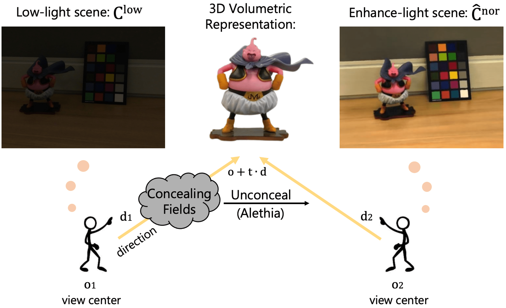

# Aleth-NeRF: Low-light Condition View Synthesis with Concealing Fields

[Ziteng Cui<sup>1,2</sup>](https://cuiziteng.github.io/), 
[Lin Gu<sup>3,2</sup>](https://sites.google.com/view/linguedu/home), 
[Xiao Sun<sup>2*</sup>](https://jimmysuen.github.io/), 
[Yu Qiao<sup>2</sup>](http://mmlab.siat.ac.cn/yuqiao/), 
[Tatsuya Harada<sup>2,3</sup>](https://www.mi.t.u-tokyo.ac.jp/harada/). 

<sup>1.</sup>The University of Tokyo, <sup>2.</sup>Shanghai AI Lab, <sup>3.</sup>RIKEN AIP

<br/>

***" Can you see your days blighted by darkness ? "
\
                      -- Pink Floyd (Lost For Words)***

<br/>


## :house: Abstract


Common capture low-light scenes are challenging for most computer vision techniques, including Neural Radiance Fields (NeRF). Vanilla NeRF is viewer-centred that simplifies the rendering process only as light emission from 3D locations in the viewing direction, thus failing to model the low-illumination induced darkness. Inspired by emission theory of ancient Greek that visual perception is accomplished by rays casting from eyes, we make slight modifications on vanilla NeRF to train on multiple views of low-light scene, we can thus render out the well-lit scene in an **unsupervised** manner. We introduce a surrogate concept, Concealing Fields, that reduce the transport of light during the volume rendering stage. Specifically, our proposed method, **Aleth-NeRF**, directly learns from the dark image to understand volumetric object representation and concealing field under priors. By simply eliminating Concealing Fields, we can render a single or multi-view well-lit image(s) and gain superior performance over other 2D low light enhancement methods. Additionally, we collect the first paired LOw-light and normal-light Multi-view **(LOM)** datasets for future research.

<!--  -->
<div align="center">
  
</div>
<p align="center">
  <font size=1.0> We assume objects are naturally visible. However, the Concealing Field attenuates the light in the viewing direction, making the left user see a low-light scene. Aleth-NeRF takes a low-light image as input and unsupervisly learns the distribution of the Concealing Field. Then, we unconceal (alethia) the Concealing field to render the enhanced image.</font>
</p>

<br/>

## :key: Enviroment setup:

We build the environment follow [NeRF-Factory projcet](https://github.com/kakaobrain/nerf-factory), and please adapt to your own cuda version:

```
1.
$ git clone https://github.com/cuiziteng/Aelth-NeRF.git

$ cd Aleth-NeRF

2.
$ conda create -n aleth_nerf -c anaconda python=3.8
$ conda install pytorch==1.11.0 torchvision==0.12.0 torchaudio==0.11.0 cudatoolkit=11.3 -c pytorch
$ pip3 install -r requirements.txt

## Or you could directly build from nerf_factory.yml: 
$ conda env create --file nerf_factory.yml

3.
$ conda activate aleth_nerf
```


<br/>

## :computer: Usage:

### (1). LOM dataset

We collect the first paired low and normal light multi-view images dataset, names **LOM** dataset. Download the **LOM** dataset from: [google drive](https://drive.google.com/file/d/1YBSHMSFmHxAHHS9qo_qdthchhl8IlKCP/view?usp=share_link) or [baiduyun (passwd: qeb7)](https://pan.baidu.com/s/1Y76ya8YniIe4GpjGVBzlOg). 

LOM dataset contains 5 scenes (*buu* | *chair* | *sofa* | *bike* | *shrub*), each scene includes 25~65 paired multi-view normal-light and low-light images, and low-light images enhanced by different 2D low-light enhancement methods.

Unzip the download file, place LOM under $data$ folder, then LOM dataset format as follow:

```
data     
└───
    LOM_full      
    └─── buu
        │─── colmap_sparse
        │─── colmap_text
        │─── enh_HE (images enhanced by [Histogram Equlization])
        │─── enh_LIME (images enhanced by [LIME, TIP 2017])
        │─── enh_RetiNexNet (images enhanced by [RetiNexNet, BMVC 2018])
        │─── enh_SCI (images enhanced by [SCI, CVPR 2022])
        │─── enh_IAT (images enhanced by [IAT, BMVC 2022])
        │─── high (normal-light images)
        │─── low  (low-light images)
        │─── colamp.db
        │─── transforms_test.json (test scenes)
        │─── transforms_train.json (train scenes)
        │─── transforms_val.json (validation scenes)

    │─── chair 
        │─── ...     
    │─── sofa
        │─── ...     
    │─── bike
        │─── ...     
    │─── shrub
        │─── ...     
```

### (2). Training Aleth-NeRF

By default, we use 4 GPUs to train Aleth-NeRF on LOM dataset (around **3 hours ~ 4 hours** per scene), you can also change to other GPU number. We take "*buu*" scene training for example:

```
$ CUDA_VISIBLE_DEVICES=0,1,2,3 python3 run.py --ginc configs/LOM/aleth_nerf/aleth_nerf_buu.gin --eta 0.1
```

Here the hyper-parameter conceal degree "--eta" : "$\eta$" (see Sec.3.3 and Sec.C in our paper), is default set to 0.1 in "*buu*" and "*sofa*" scenes, to 0.05 in "*shrub*", "*chair*" and "*bike*" scenes.

Beyond, the "--overall_g" (adjust final render lightness, default 1.0) better set to 1.5 in "*bike*" and "*shrub*" scene. "*bike*" scene for example:

```
$ CUDA_VISIBLE_DEVICES=0,1,2,3 python3 run.py --ginc configs/LOM/aleth_nerf/aleth_nerf_bike.gin --eta 0.05 --overall_g 1.5
```

Or directly use following command to run all 5 scenes:

```
$ bash run/run_LOM_aleth.sh
```

### (3). Evaluation with pre-train weights

You could also download our pre-train weights for direct model evaluation [google drive](https://drive.google.com/file/d/142G9GBqNRY_QiiYYCXXe8tcC5GbeDzxV/view?usp=share_link) or [baiduyun (passwd:gkiw)](https://pan.baidu.com/s/1-NyB3rDYrcT6rSQ7O0eRmw), then unzip the file under this folder (./logs), final test each scene as follow:

```
# buu
$ CUDA_VISIBLE_DEVICES=0,1,2,3 python3 run.py --ginc configs/LOM/aleth_nerf/aleth_nerf_buu.gin --ginb run.run_train=False

# chair
$ CUDA_VISIBLE_DEVICES=0,1,2,3 python3 run.py --ginc configs/LOM/aleth_nerf/aleth_nerf_buu.gin --eta 0.05 --ginb run.run_train=False

# sofa
$ CUDA_VISIBLE_DEVICES=0,1,2,3 python3 run.py --ginc configs/LOM/aleth_nerf/aleth_nerf_buu.gin --ginb run.run_train=False

# bike
$ CUDA_VISIBLE_DEVICES=0,1,2,3 python3 run.py --ginc configs/LOM/aleth_nerf/aleth_nerf_bike.gin --eta 0.05 --overall_g 1.5 --ginb run.run_train=False

# shrub
$ CUDA_VISIBLE_DEVICES=0,1,2,3 python3 run.py --ginc configs/LOM/aleth_nerf/aleth_nerf_shrub.gin --eta 0.05 --overall_g 1.5 --ginb run.run_train=False
```

### (4). Optional-1: Comparision Methods on LOM dataset

1. Training NeRF on low-light images, "*buu*" scene training for example:

```
$ CUDA_VISIBLE_DEVICES=0,1,2,3 python3 run.py --ginc configs/LOM/nerf/nerf_buu.gin
```

2. Training NeRF on low-light images enhanced by various 2D enhancement methods (HE, [LIME](https://ieeexplore.ieee.org/document/7782813), [RetiNexNet](https://daooshee.github.io/BMVC2018website/), [SCI](https://openaccess.thecvf.com/content/CVPR2022/papers/Ma_Toward_Fast_Flexible_and_Robust_Low-Light_Image_Enhancement_CVPR_2022_paper.pdf), [IAT](https://bmvc2022.mpi-inf.mpg.de/238/)), "*buu*" scene training for example:

```
$ CUDA_VISIBLE_DEVICES=0,1,2,3 python3 run.py --ginc configs/LOM/compare_methods/HE(or LIME, RetiNexNet, SCI, IAT)/nerf_buu.gin
```

### (5). Optional-2: LOL dataset training (Single Image Enhancement)

**TBD**
<!-- Aleth-NeRF is not designed for single image low-light enhancement. But you could also complete single image enhancement with our code (camera parameters are fixed): -->


<br/>

## :smile: Others:

If you want to editing the code or figure model details of Aleth-NeRF, direct refer to [model.py](src/model/aleth_nerf/model.py) and [helper.py](src/model/nerf/helper.py).

<br/>

## Reference and Related Works:

**Acknowledgement:**

Code is based on [NeRF-Factory](https://github.com/kakaobrain/nerf-factory), much thanks to their excellent codebase. Also if you use **LOM** dataset or our code & paper help you, please consider cite our work:

```
@misc{cui2023alethnerf,
      title={Aleth-NeRF: Low-light Condition View Synthesis with Concealing Fields}, 
      author={Ziteng Cui and Lin Gu and Xiao Sun and Yu Qiao and Tatsuya Harada},
      year={2023},
      eprint={2303.05807},
      archivePrefix={arXiv},
      primaryClass={cs.CV}
}
```
<br/>

**My Other Related Projects:**

**(1)**.  **Transformer for Low-light enhancement and exposure correction**, **BMVC 2022**: *You Only Need 90K Parameters to Adapt Light: a Light Weight Transformer for Image Enhancement and Exposure Correction* [(code)](https://github.com/cuiziteng/Illumination-Adaptive-Transformer) [(paper)](https://bmvc2022.mpi-inf.mpg.de/0238.pdf).

**(2)**.  **Object detection in Low-light Condition**, **ICCV 2021**: *Multitask AET with Orthogonal Tangent Regularity for Dark Object Detection* [(code)](https://github.com/cuiziteng/ICCV_MAET) [(paper)](https://openaccess.thecvf.com/content/ICCV2021/papers/Cui_Multitask_AET_With_Orthogonal_Tangent_Regularity_for_Dark_Object_Detection_ICCV_2021_paper.pdf).